[简体中文](README.md) | **English**

<picture>
  <source media="(max-width: 640px) and (prefers-color-scheme: dark)" srcset="assets/presentation/hero-mobile-dark.svg">
  <source media="(max-width: 640px)" srcset="assets/presentation/hero-mobile-light.svg">
  <source media="(prefers-color-scheme: dark)" srcset="assets/presentation/hero-dark.svg">
  
</picture>

**DropProbe lists recently updated repositories from selected model organizations alongside local hardware information and provides static candidate quantization, backend and tooling records.**

`Python 3.12+` · [MIT](LICENSE) · [GitHub](https://github.com/SuperMarioYL/dropprobe) · [Website](https://dropprobe.lei6393.com)

## Why it helps

Preparing to try a model involves repository locations, quantization sizes, backend branches and machine memory. Collecting these hints helps plan the next step, but static capacity arithmetic cannot prove inference succeeds. This version provides discovery and static assembly; real smoke probing is not wired in.

<picture>
  <source media="(max-width: 640px) and (prefers-color-scheme: dark)" srcset="assets/presentation/process-mobile-dark.svg">
  <source media="(max-width: 640px)" srcset="assets/presentation/process-mobile-light.svg">
  <source media="(prefers-color-scheme: dark)" srcset="assets/presentation/process-dark.svg">
  
</picture>

## Architecture

drops queries Hub entries for a fixed organization list, hardware gathers available device information, and config_db loads bundled YAML. build_probe_card combines these records and selects the smallest candidate quantization. probe_drop currently returns NOT_PROBED; report renders lists, hardware or API-supplied cards as tables/JSON.

<picture>
  <source media="(max-width: 640px) and (prefers-color-scheme: dark)" srcset="assets/presentation/architecture-mobile-dark.svg">
  <source media="(max-width: 640px)" srcset="assets/presentation/architecture-mobile-light.svg">
  <source media="(prefers-color-scheme: dark)" srcset="assets/presentation/architecture-dark.svg">
  
</picture>

## Install

Requires Python 3.12+. Installation may need network access; start with the static example, which neither queries the Hub, detects the machine nor launches a model.

```bash
git clone https://github.com/SuperMarioYL/dropprobe.git
cd dropprobe
python3 -m venv .venv
source .venv/bin/activate
python -m pip install -e .
```

## Quickstart

```bash
python examples/presentation_demo.py
```

The example explicitly declares CPU RAM profiles of 8 GiB and 2 GiB, with 4 GiB Q4 and 8 GiB Q8 candidates. Both select the smallest candidate, Q4. runnable is true for the first and null for the second, but both have not_probed status and null smoke_probe_ok. Here true is only a static capacity hint.

## Usage

```bash
# These commands query Hugging Face and inspect local hardware
dropprobe latest --list
dropprobe latest --list --window 14
dropprobe latest --list --cache-dir /path/to/model-cache --json
dropprobe --version
```

latest without --list still does not run inference in this version; the NOT_PROBED path falls back to the list. Window dates prefer Hub lastModified, so recent entries are not necessarily newly released models.

## Capabilities and integrations

| Component | Current support |
|---|---|
| Hub query | Fixed organizations and aliases |
| Hardware | NVML, ROCm and CPU/RAM/disk fallback |
| YAML DB | Candidate quantizations, backend refs and tooling declarations |
| Python API | Drop + HardwareProfile → ProbeCard |
| Output | Repository/hardware tables and JSON |

<picture>
  <source media="(max-width: 640px) and (prefers-color-scheme: dark)" srcset="assets/presentation/integrations-mobile-dark.svg">
  <source media="(max-width: 640px)" srcset="assets/presentation/integrations-mobile-light.svg">
  <source media="(prefers-color-scheme: dark)" srcset="assets/presentation/integrations-dark.svg">
  
</picture>

## Configuration and limits

--window defaults to seven days and accepts 1–90. --cache-dir selects the volume used for free-space detection. Bundled declarations live in src/dropprobe/data/config_db.yaml; they are maintainer data, not live backend acceptance.

Static GPU arithmetic reserves roughly 1.5 GiB; CPU mode compares RAM without estimating all runtime overhead. Unsupported accelerator detection may fall back to CPU, which does not prove the absence of other accelerators. Failed Hub requests can yield an empty list, so emptiness does not establish that no repositories changed. run_cmd is a text template not executed by this demo; check actual backend arguments.

## Recorded demo

Real static-assembly API output from v0.1.0. Model, backend and hardware values are constructed inputs, not downloads, detected hardware or successful inference records.

[Inputs, commands and complete output](docs/demo-results.json)

## Roadmap

- [x] Recent repository queries and hardware profiles.
- [x] Static config DB, ProbeCard assembly and JSON output.
- [ ] Real model acquisition and backend smoke probes.
- [ ] Configurations and commands validated by actual runs.

The current version makes no guaranteed thirty-second readiness claim.

## Development and license

```bash
python -m pip install -e ".[test]"
python -m pytest
```

See [test_probe.py](tests/test_probe.py) for static behavior and the NOT_PROBED contract.

[MIT](LICENSE) · [Issues](https://github.com/SuperMarioYL/dropprobe/issues)
