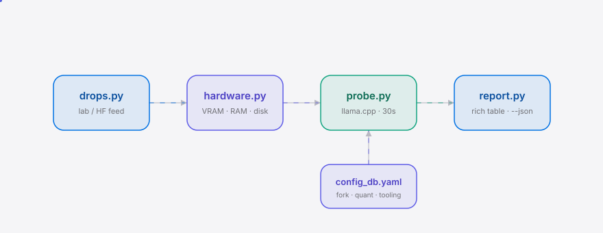

**English** | [简体中文](./README.md)

<div align="right"><sub><b>English</b>&nbsp;&nbsp;⇄&nbsp;&nbsp;<a href="./README.md">中文</a></sub></div>

<p align="center">
<picture>
  <source media="(prefers-color-scheme: dark)" srcset="./assets/hero-dark.svg">
  <source media="(prefers-color-scheme: light)" srcset="./assets/hero-light.svg">
  
</picture>
</p>

<p align="center"><sub>A one-command smoke-probe for each weekly open-weight model drop — fire a 30-second test inference on your own hardware and learn which fork / quant / config actually runs.</sub></p>

<p align="center">
  <a href="./LICENSE"></a>
  <a href="https://github.com/SuperMarioYL/dropprobe/releases"></a>
  <a href="https://github.com/SuperMarioYL/dropprobe/actions/workflows/ci.yml"></a>
  
</p>

**Every week a new open-weight model drops, and you're back to hand-hunting forks, guessing GGUF quants, and checking day-0 support. DropProbe runs one command that smoke-probes each new drop against your actual hardware and hands you the fork / quant / config that runs.**

<h2> Architecture</h2>

<p align="center">
<picture>
  <source media="(prefers-color-scheme: dark)" srcset="./assets/atlas-dark.svg">
  <source media="(prefers-color-scheme: light)" srcset="./assets/atlas-light.svg">
  
</picture>
</p>

Data flow: `drops.py` pulls the week's carousel from HF → `hardware.py` detects local VRAM / RAM / disk → `probe.py` fires a 30s test inference on the smallest viable quant → `report.py` renders a rich table / `--json`. `config_db.yaml` feeds each drop's fork / quant / day-0 tooling-readiness into the probe layer.

## Contents

- [Why this exists](#why-this-exists)
- [Install](#install)
- [Quickstart](#quickstart)
- [Usage](#usage)
- [Demo](#demo)
- [Roadmap](#roadmap)
- [License](#license)

<h2> Why this exists</h2>

A r/LocalLLaMA poster put it plainly: "the open-weights carousel never stops" — DeepSeek, Kimi, GLM, Qwen, and MiniMax drop in near-weekly rotation, and each drop forces the same manual chore: which llama.cpp fork supports it, which GGUF quant fits your VRAM, and whether ComfyUI / llama.cpp added day-0 support yet. The sharpest case is a developer who, "annoyed that there was no way to poke at it on my own machine," wrote a custom C99 inference engine from scratch. DropProbe collapses that recurring chore into one command: it fires a real 30-second inference on your **actual hardware** per drop and prints a ProbeCard table with a copy-paste run command. Static VRAM arithmetic only tells you whether a quant *fits*; the smoke-probe tells you whether the fork *actually runs*.

<h2> Install</h2>

```bash
# Recommended via uv (< 30s; no model weights are downloaded at install)
uv tool install dropprobe
# or via pipx
pipx install dropprobe
```

> Requires `llama.cpp` (`llama-cli`) or `ollama` on PATH. The m2 smoke-probe auto-selects one; if neither is present it degrades to listing drops + your hardware profile (the m1 behavior).

<h2> Quickstart</h2>

```bash
# 1. Install
uv tool install dropprobe
# 2. List this week's drops + your hardware profile (m1 — no probe yet)
dropprobe latest --list
# 3. (from m2) run the smoke-probe and copy the runnable command
dropprobe latest
```

<details><summary>Sample output (m1 <code>--list</code>)</summary>

```
DropProbe 0.1.0 — fetching the last 7d of drops...

This week's open-weight drops
 Model                                  Lab       Drop date   Files
 moonshotai/Kimi-K3-Instruct           Kimi      2026-08-01    14
 deepseek-ai/DeepSeek-V4-Flash         DeepSeek  2026-07-30    22
 zhipuai/GLM-5.5-9B-Chat               GLM       2026-07-29     8
 Qwen/Qwen3-Next-80B                   Qwen      2026-07-27    19
 MiniMaxAI/MiniMax-H3                  MiniMax   2026-07-26    31

Your hardware
 Axis             Value
 GPU arch         nvidia
 GPU              NVIDIA GeForce RTX 5090
 GPU count        2
 VRAM (GiB)       48.0
 RAM (GiB)        128.0
 Disk free (GiB)  512.0
```

</details>

<h2> Usage</h2>

```bash
# List this week's carousel + your hardware (m1 ready — probing lands in m2)
dropprobe latest --list

# Set the look-back window (default 7 days, the carousel cadence)
dropprobe latest --list --window 14

# Point at a model cache dir (to measure real free disk)
dropprobe latest --list --cache-dir /data/hf

# From m2: run the 30s smoke-probe, one ProbeCard per drop
dropprobe latest

# From m3: export the full JSON report
dropprobe latest --json > report.json

# Version
dropprobe --version
```

The core data primitive is the **ProbeCard** — one runnable-config record per drop:

| Field | Meaning |
|---|---|
| `model_id` / `lab` / `drop_date` | Model identity and release info |
| `hardware_profile` | Local VRAM / RAM / GPU arch / disk |
| `quant` | Matched GGUF quant (name / size / source repo, e.g. `Q2_K` from `GrEarl/Kimi-K3-GGUF`) |
| `backend` | Backend fork that runs it (e.g. `pwilkin/llama.cpp` `kimi-k3-text`) |
| `tooling` | Day-0 tooling readiness (comfyui / llama_cpp / ollama) |
| `runnable` / `smoke_probe_ok` | Smoke-probe outcome |
| `run_cmd` | Copy-paste run command |

<h2> Demo</h2>

<p align="center"></p>

The raw recording lives at `assets/demo.cast` (asciinema format); `docs/demo.tape` is a replayable vhs script and `.github/workflows/demo.yml` re-renders the gif on demand.

<h2> Roadmap</h2>

- [x] **m1 · fetch drops** — pull the week's carousel from HF / lab list + detect local hardware; `dropprobe latest --list` prints drops + hardware profile.
- [ ] **m2 · smoke-probe** — pick the smallest viable quant + backend fork from the config DB, fire a 30s test inference via llama.cpp / ollama, record `runnable` / `smoke_probe_ok`; `dropprobe latest` runs probes.
- [ ] **m3 · report config** — print the full ProbeCard table (model / best-fit quant / VRAM fits / fork / tooling-readiness / run command) + `dropprobe latest --json` export.
- [ ] Future — a community PR pipeline to add drop rows to the config DB (the "real usage" signal the plan watches for).

<h2> License</h2>

MIT — see [LICENSE](./LICENSE). File issues or PRs at [GitHub Issues](https://github.com/SuperMarioYL/dropprobe/issues).

<p align="center"><sub><a href="./LICENSE">MIT</a> © 2026 SuperMarioYL</sub></p>
